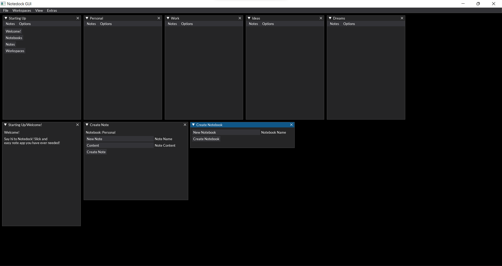

# Notedock v3

Notedock is a python CLI and GUI notes app.

## Installation

Download the project and run:

```shell
# Select current directory to project
cd <path-to-project>

# Install required libraries
pip install -r requirements.txt
```

## Usage

Run scripts respectively:
```bash
python <script>
```

- CLI - notedock-cli.py
  - Example usage
    ```python
    # Change workspace from basic
    change_workspace "workspace3"
    
    # Add new notebook
    add_notebook "Personal"
    
    # Add new note to "Personal" notebook
    add_note "Personal" "Car" "Buy new freshener"
    ```
  - Please note that base command contains **_ (underscore)** and parameters should be separated with spaces
  - To include parameters with multiple words, wrap them in quotation marks
      ```python
      # Wrong :(
      add_notebook Long long notebook name
      
      # Correct :)
      add_notebook "Long long notebook name"
      ```
- GUI - notedock-gui.py
  - Example view of workspace
  
## Features

Available Notedock CLI commands

- help : Displays all available commands
- refresh : Refreshed data
- workspaces ls : Lists all workspaces
- notebooks ls : Lists all notebooks
- ls : Lists all notebooks with their notes
- change workspace <workspace_name>: Changes current workspace
- add notebook <notebook_name>: Adds new notebook
- rename notebook <old_notebook_name> <new_notebook_name>: Renames notebook
- delete notebook <notebook_name>: Delets notebook
- add note <notebook_name> <note_name> <note_content>: Adds note to the notebook
- edit note <notebook_name> <old_note_name> <new_note_name> <note_content>: Edits note
- delete note <notebook_name> <note_name>: Deletes notes
- show note <notebook_name> <note_name>: Previews note content

## Updates

To update Notedock to the newest version, just pull this repository into your existing project folder

In order to preserve notes, make sure that your existing **workspaces** and **logs**
directories will be places in the newest project folder

## Contributing

Pull requests are welcome. For major changes, please open an issue first
to discuss what you would like to change.

Please make sure to update tests as appropriate.

## License

[MIT](https://choosealicense.com/licenses/mit/)